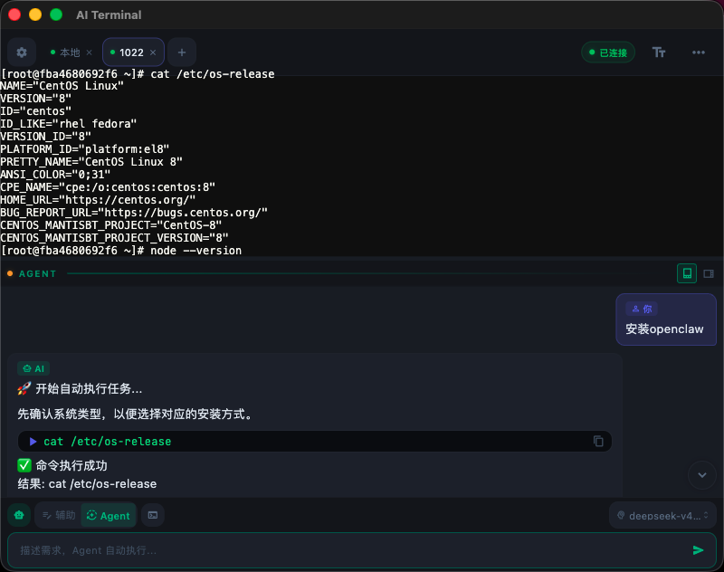
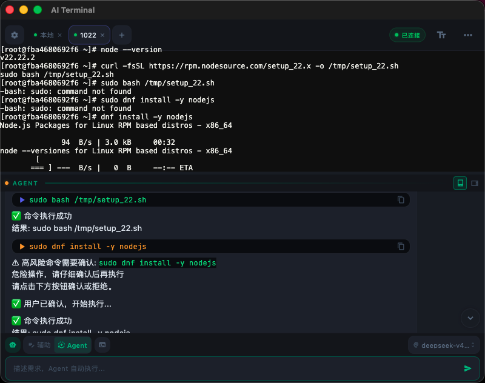
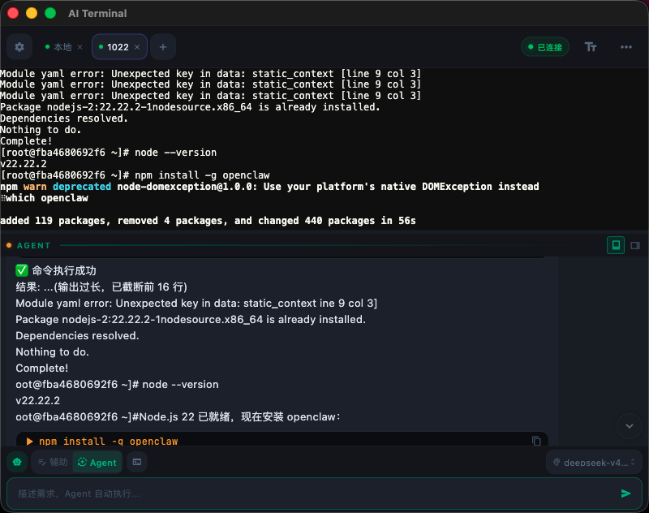
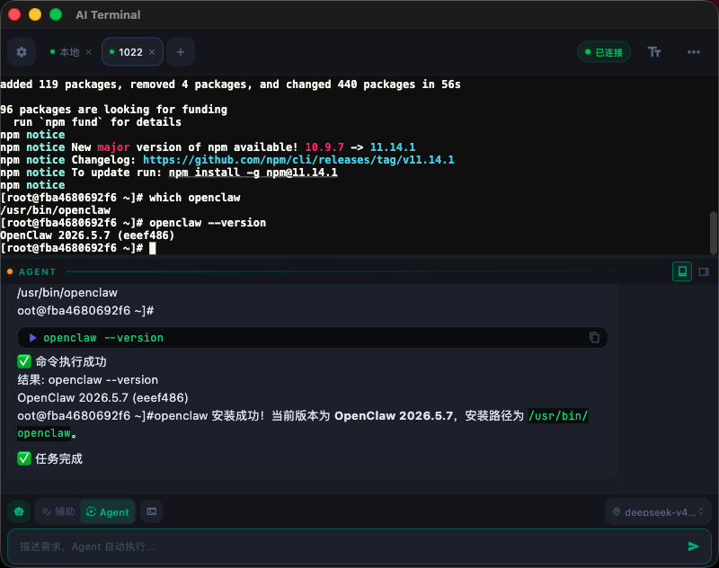

<p align="center">
  
  <h1 align="center">⚡ AI Terminal</h1>
  <p align="center">
    <strong>Control your servers with natural language. AI runs the commands for you.</strong>
  </p>
  <p align="center">
    <a href="https://ai-terminal.keiskei.top" target="_blank">🌐 Website</a> · 
    <a href="https://github.com/keiskeies/ai_terminal/releases" target="_blank">📦 Download</a> · 
    <a href="./QUESTION.md">❓ FAQ</a>
  </p>
  <p align="center">
    
    
    
    
  </p>
</p>

---

[中文](./README.md) | **English**

## One sentence to explain it

> **Never used a terminal? No problem.** Open AI Terminal, tell it what you want in plain English — it connects to your server, runs commands, installs software, and troubleshoots issues. All safe and under your control.

## 🎯 Sound familiar?

### 😫 Beginners / Non-technical users

- You rented a VPS, opened the terminal, and stared at a **black screen** with no idea what to type
- A friend said "just install Nginx" — you Googled 10 tutorials, each with different commands
- You tried setting up Java, edited `PATH` wrong, and broke your entire terminal
- Someone warned you about a server vulnerability — you don't even know how to check
- After 3 hours of tinkering, nothing works. You're done.

### 👨‍💻 Developers

- You Google the same `chmod` / `systemctl` commands every single time
- SSH into a server, blank on the exact `grep` flags you need
- Want to check logs? First, find that bookmark from 6 months ago
- 15 browser tabs open, switching between servers, losing track of what's where

### 🔧 DevOps / SysAdmins

- Same software on 10 servers? SSH into each one and repeat. Again.
- "Who changed that config?" — no one remembers, nothing is logged
- New hire asks "how do I set up the environment?" — you've explained it 5 times this month
- Want to do a batch health check? Writing the script takes longer than doing it manually

### 🧑‍💼 Product Managers / Solo founders

- Your only developer left. The server is now a black box.
- You need to check some data but can't write SQL. You have to ask someone.
- Deploying a config change requires a dev sprint. It's literally one line.
- You wear 5 hats. You don't have time to learn `vi`.

**Every scenario above? One sentence to AI Terminal solves it.**

## 💡 What can it do for you?

### Install software? Just say it.

> 💬 "Install Docker on this server"

AI detects your OS version, matches official docs, runs the install commands, and verifies it worked. Zero commands to memorize.

### Configure environments? No more PATH headaches.

> 💬 "Set up Python 3.12 with proper environment variables"

AI knows Debian uses `apt`, CentOS uses `yum`, macOS uses `brew`. It doesn't guess — it follows official documentation strictly.

### Check for vulnerabilities? It's more paranoid than you are.

> 💬 "Scan my server for security issues"

AI runs system update checks, port scans, and process audits automatically. You get a full report of what to fix.

### Read logs? No more digging through bookmarks.

> 💬 "Show me recent Nginx errors"

AI knows where logs live, how to filter them, and what matters. Key info, no `tail -f` gymnastics.

### Manage servers? Multiple machines, one interface.

SSH remote connections with connection pooling. Switch between servers with zero delay. Multiple tabs, one shared connection.

## 🛡️ Security: The elephant in the room

Handing your server to an AI sounds terrifying. Three valid concerns:

### 🔐 "Where do my passwords go?"

```
Your password → System-level secure storage (macOS Keychain / Android Keystore)
                       ↓
              Local database stores only "which key was used," never the password itself
                       ↓
              Passwords never appear in plaintext in logs, config files, or on disk
```

Even if someone steals your device, without your biometric/passcode, all they get is encrypted gibberish.

### 🤖 "Can the AI go rogue?"

**No.** Three layers of defense:

```
┌─────────────────────────────────────────────────────┐
│ Layer 1: Behavior Boundary Prompts                   │
│ AI system instructions explicitly prohibit:          │
│   ✗ Installing/uninstalling software without asking  │
│   ✗ Modifying env vars or system configs             │
│   ✗ Running destructive operations                   │
│   ✓ "Check/inspect" requests → read-only commands    │
│   ✓ Issues found → report first, never self-fix      │
└─────────────────────────────────────────────────────┘
                         ↓
┌─────────────────────────────────────────────────────┐
│ Layer 2: SafetyGuard Command Classification          │
│ Every command is reviewed before execution:          │
│   🔴 blocked → Blocked immediately, never runs       │
│      (rm -rf /, chmod 777, disk formatting, etc.)    │
│   🟡 warn → Popup warning, requires CONFIRM input    │
│      (apt install, systemctl stop, firewall changes)  │
│   🔵 info → Low-risk heads-up, runs normally         │
│      (curl, wget, ls, cat, etc.)                     │
└─────────────────────────────────────────────────────┘
                         ↓
┌─────────────────────────────────────────────────────┐
│ Layer 3: You Are the Final Gate                      │
│ You are always the last line of defense.             │
│ warn-level commands don't execute without CONFIRM.   │
│ You can interrupt, cancel, or review any time.       │
└─────────────────────────────────────────────────────┘
```

### 📋 Agent Behavior Charter

| What you can ask | What AI will do | What AI won't do |
|:---|:---|:---|
| Install software | Generate official install commands & run them | Decide which version to install on its own |
| Check security | Run audit commands & report findings | Fix issues without your permission |
| Configure environment | Follow official docs exactly | Change system params you didn't ask about |
| Read logs | Filter & show key information | Delete or modify log files |
| Manage services | Start/stop the services you specified | Start other services you didn't mention |

**TL;DR: AI is your assistant, not your boss. It does what you ask. Nothing more.**

## ✨ Core Features

| Feature | Description |
|:---|:---|
| 🤖 **Agent Auto-Execution** | AI generates commands and executes them in a loop until task completion |
| 🛡️ **Triple Security** | Behavior boundary prompts → SafetyGuard command classification → Dangerous ops require CONFIRM |
| 🔐 **Zero Plaintext Credentials** | Passwords/private keys in system Keychain / Keystore, never on disk in plaintext |
| 🖥️ **5 Native Platforms** | macOS / Linux / Windows / Android / iOS — full native support |
| 📡 **Local + Remote** | SSH remote connections + local PTY terminal; Agent works in both modes |
| 🔄 **Connection Pool** | SSH connection pooling — multiple tabs share one connection, zero-delay switching |
| 🌊 **Streaming Output** | AI responses render in real-time; terminal output streams live |
| 🧠 **Knowledge-Driven** | 150+ software install/config guides built in — follows official docs, no AI hallucination |
| 🌐 **20+ Providers** | DeepSeek / Qwen / Claude / Gemini / Ollama & more, with remote config updates |

## 🏗️ Tech Stack

```
Flutter 3.16+ (Dart 3.2+)
├── State Management: Riverpod
├── Routing: GoRouter
├── Local Storage: Hive + flutter_secure_storage
├── SSH: dartssh2
├── Local Terminal: flutter_pty
├── Terminal UI: xterm.dart
├── AI Interface: OpenAI-compatible (20+ providers)
└── Markdown: flutter_markdown
```

## 🚀 Getting Started

### Prerequisites

- Flutter 3.16.0+
- Dart 3.2.0+
- Platform-specific dev tools (Xcode / Android Studio / VS Code, etc.)

### Install & Run

```bash
# Clone the repo
git clone https://github.com/keiskeies/ai_terminal.git
cd ai_terminal/ai_terminal

# Install dependencies
flutter pub get

# Generate Hive Adapters (first time only)
dart run build_runner build --delete-conflicting-outputs

# Run
flutter run
```

### Build for Release

```bash
# macOS
flutter build macos --release

# Windows
flutter build windows --release

# Linux
flutter build linux --release

# Android APK
flutter build apk --release

# iOS (requires macOS + developer certificate)
flutter build ios --release
```

> 📥 Or download pre-built binaries from [Releases](https://github.com/keiskeies/ai_terminal/releases).

## 🔧 Configuring AI Models

The app comes with **20+ AI provider presets** and supports any **OpenAI-compatible API**:

| Category | Providers |
|:---|:---|
| 🏠 Local | Ollama (completely free, no API key needed) |
| 🇨🇳 China Cloud | DeepSeek / Qwen / GLM / Kimi / Doubao / MiMo / MiniMax / SiliconFlow / StepFun / Baichuan / Spark / Hunyuan |
| 🌍 Global Cloud | OpenAI / Claude / Gemini / xAI Grok / Mistral / OpenRouter / Groq |
| 🔧 Custom | Any OpenAI-compatible API endpoint |

Setup steps:

1. Open the app → Settings → AI Model Configuration
2. Click `+` to add a model
3. Select a provider (Base URL and recommended models are auto-filled)
4. Enter your API Key and select a model
5. Set as default model

> 💡 Provider list supports remote updates: click the 🔄 button next to the provider dropdown to fetch the latest providers and models from the server — no app update required

## 📱 Screenshots

| Server Management | SSH Terminal |
|:---:|:---:|
|  |  |

| AI Chat Assistant | Agent Auto-Execution |
|:---:|:---:|
|  |  |

<p align="center">
  
  <br /><b>AI Model Configuration</b>
</p>

> 🤖 AI features powered by <b>Xiaomi MiMo</b> LLM

## 📖 Demo: Knowledge-Driven Auto Install

v1.3.0 introduced a **Command Manual Knowledge Base** — 150+ official install/uninstall/update guides. The Agent automatically matches the knowledge base and strictly follows official methods, **eliminating AI hallucination**.

Below: typing "install openclaw" after SSH-ing into an Ubuntu server:

| ① Enter command | ② Knowledge base match, generate commands |
|:---:|:---:|
|  |  |

| ③ Auto-execute installation | ④ Verify installation |
|:---:|:---:|
|  |  |

**Flow breakdown:**

1. User types "install openclaw" → Agent extracts operation (install) and platform (linux)
2. Knowledge base matches `openclaw` for `linux-debian` (strict mode), injecting official install commands
3. Agent follows knowledge base exactly: installs Node.js 22, then `npm install -g openclaw`
4. Post-install verification: runs `openclaw --version` to confirm success

> 💡 Knowledge base supports platform-specific matching (`linux-debian` vs `linux-rhel` yield different package manager commands), with one-click remote updates

## 🗺️ Roadmap

- [x] v1.0.0 — Core feature release
  - [x] SSH remote terminal + local PTY terminal
  - [x] AI chat + command generation + auto-execution
  - [x] SafetyGuard command safety check
  - [x] Encrypted credential storage
  - [x] Multi-model configuration
- [x] v1.1.0 — UI enhancement
  - [x] AI panel layout redesign
  - [x] Mobile auto-orientation
  - [x] Agent mode green theme
- [x] v1.2.0 — Agent intelligence boost
  - [x] Persistent conversation history across tasks
  - [x] Query command output no longer truncated
  - [x] Unlimited execution steps by default
  - [x] SFTP file management + remote editing
- [x] v1.3.0 — Knowledge-driven
  - [x] 🧠 SQLite FTS5 full-text search knowledge base (150+ software guides)
  - [x] 🔄 Remote knowledge base auto-sync (updates from GitHub on launch)
  - [x] 🎯 Platform-specific matching (linux-debian / linux-rhel / macos)
  - [x] 🛡️ LLM safety rules (strict enforcement + search command prohibition)
  - [x] 🔧 Knowledge base build tool (CSV → SQLite)
  - [x] 💬 Friendly API error messages (401/429/timeout)
- [x] v1.3.1 — Provider ecosystem
  - [x] 🌐 20+ AI provider presets (12 China + 8 Global + Ollama + Custom)
  - [x] 🔄 Remote provider config updates (no app update needed)
  - [x] 🏷️ Provider descriptions and pricing info
  - [x] 🤖 Preset model quick selection (one-click)
  - [x] 🦙 Ollama local deployment (no API key, completely free)
  - [x] 📐 Add model dialog optimization (wide-screen dual-column layout)

## 🤝 Contributing

Contributions welcome! Bug reports, feature suggestions, or code.

1. Fork this repository
2. Create a feature branch (`git checkout -b feature/amazing-feature`)
3. Commit your changes (`git commit -m 'Add amazing feature'`)
4. Push to the branch (`git push origin feature/amazing-feature`)
5. Open a Pull Request

## 📄 License

[MIT License](./LICENSE)

---

## ⭐ Star History

[](https://star-history.com/#keiskeies/ai_terminal&Date)

---

<p align="center">
  If this project helps you, please give it a ⭐ Star!
</p>
