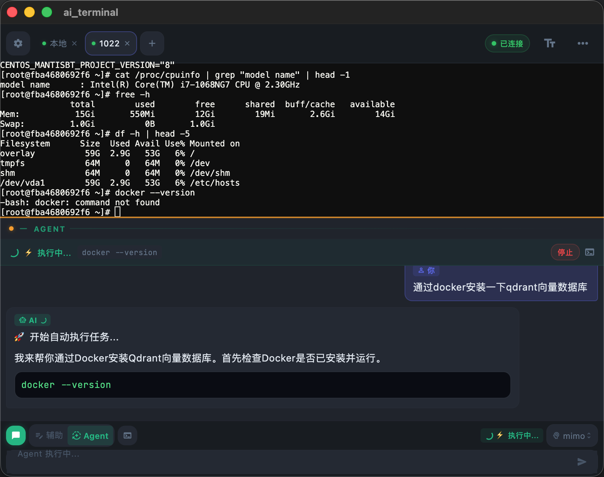
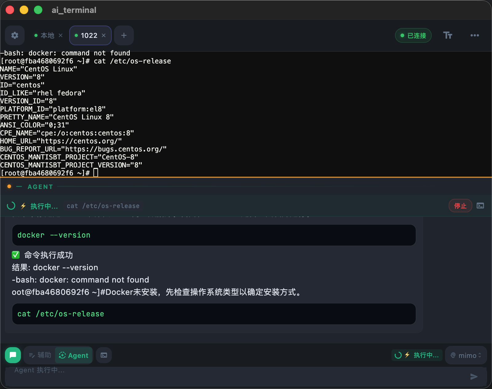
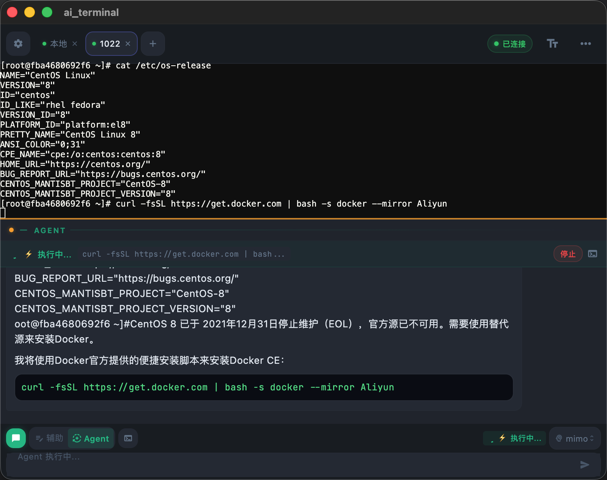
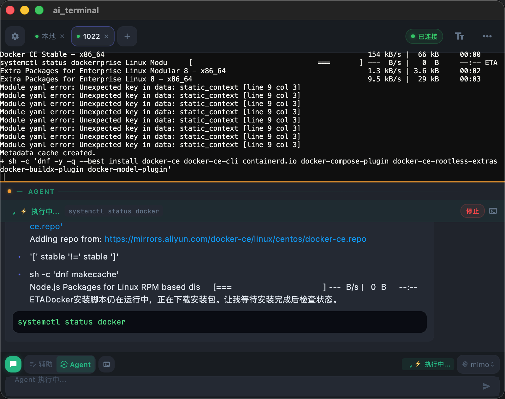
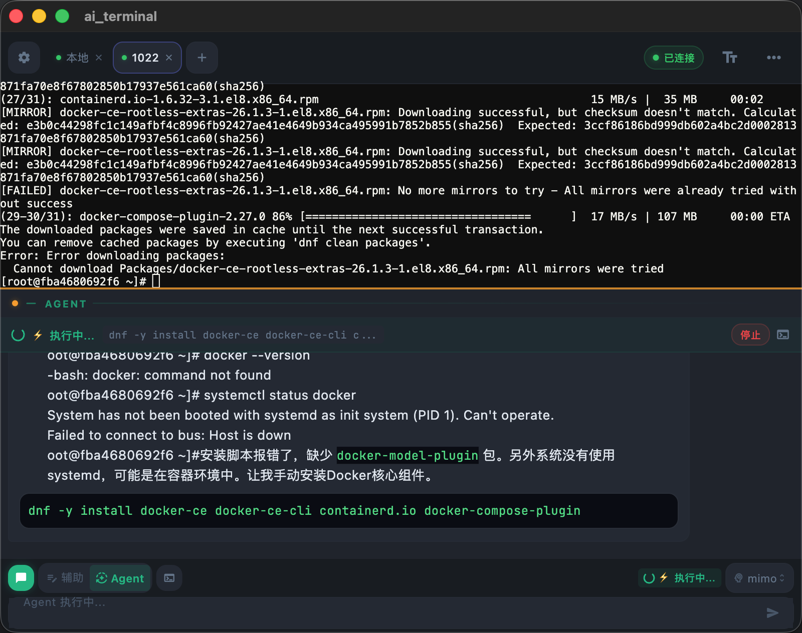

<p align="center">
  
  <h1 align="center">⚡ AI Terminal</h1>
  <p align="center">
    <strong>AI-Powered Cross-Platform Secure Terminal</strong>
  </p>
  <p align="center">
    <a href="https://ai-terminal.keiskei.top" target="_blank">🌐 Website</a> · 
    <a href="https://github.com/keiskeies/ai_terminal/releases" target="_blank">📦 Download</a> · 
    <a href="./QUESTION.md">❓ FAQ</a>
  </p>
  <p align="center">
    
    
    
    
  </p>
</p>

---

[中文](./README.md) | **English**

## 🎯 What is this?

AI Terminal is a cross-platform app that deeply integrates an **AI assistant** with **SSH / local terminals**. Tell the AI what you want in natural language — it generates commands, executes them, and analyzes results — all within a secure sandbox.

> 💬 *"Check my JDK installation"* → AI runs `java -version` automatically and analyzes the result
>
> 💬 *"Show disk usage"* → AI runs `df -h` and suggests cleanup options

## ✨ Key Features

| Feature | Description |
|:---|:---|
| 🤖 **Dual-Mode Agent** | **Auto Mode**: AI generates and executes commands in a loop until task completion; **Assistant Mode**: AI generates commands for your review before execution |
| 🛡️ **Triple Security** | Behavior boundary prompts → SafetyGuard command classification (safe/warn/blocked) → Dangerous operations require CONFIRM input |
| 🔐 **Zero Plaintext Credentials** | Passwords/private keys stored in system-level secure storage (Keychain / Keystore), never written to disk in plaintext |
| 🖥️ **5 Native Platforms** | macOS / Linux / Windows / Android / iOS — full native support |
| 📡 **Local + Remote** | Supports both SSH remote connections and local PTY terminals; Agent works in both modes |
| 🔄 **Connection Pool** | SSH connection pooling with reference counting — multiple tabs share the same connection, zero-delay tab switching |
| 🌊 **Streaming Output** | AI responses render in real-time; terminal command output streams live — no waiting |
| 🎨 **Dark Minimal** | Carefully tuned dark theme, JetBrains Mono monospace font, native-grade terminal experience |

## 🏗️ Tech Stack

```
Flutter 3.16+ (Dart 3.2+)
├── State Management: Riverpod
├── Routing: GoRouter
├── Local Storage: Hive + flutter_secure_storage
├── SSH: dartssh2
├── Local Terminal: flutter_pty
├── Terminal UI: xterm.dart
├── AI Interface: OpenAI-compatible (DeepSeek / Qwen / GPT / any OpenAI-compatible model)
└── Markdown: flutter_markdown
```

## 🚀 Getting Started

### Prerequisites

- Flutter 3.16.0+
- Dart 3.2.0+
- Platform-specific dev tools (Xcode / Android Studio / VS Code, etc.)

### Install & Run

```bash
# Clone the repo
git clone https://github.com/keiskeies/ai_terminal.git
cd ai_terminal/ai_terminal

# Install dependencies
flutter pub get

# Generate Hive Adapters (first time only)
dart run build_runner build --delete-conflicting-outputs

# Run
flutter run
```

### Build for Release

```bash
# macOS
flutter build macos --release

# Windows
flutter build windows --release

# Linux
flutter build linux --release

# Android APK
flutter build apk --release

# iOS (requires macOS + developer certificate)
flutter build ios --release
```

> 📥 You can also download pre-built binaries from [Releases](https://github.com/keiskeies/ai_terminal/releases).

## 🔧 Configuring AI Models

The app supports any **OpenAI-compatible API**. Setup steps:

1. Open the app → Settings → AI Model Configuration
2. Click `+` to add a model
3. Fill in:
   - **API Key**: Your API key
   - **Base URL**: API endpoint (e.g. `https://api.deepseek.com/v1`, `https://api.openai.com/v1`)
   - **Model Name**: `deepseek-chat`, `gpt-4o`, `qwen-plus`, etc.
4. Set as default model

> 💡 XIAOMI MIMO-V2.5-PRO is recommended — excellent cost-performance ratio with high command generation accuracy

## 🛡️ Security Design

Security is AI Terminal's top priority:

### Credential Security
- Passwords/private keys stored via `flutter_secure_storage` in system Keychain / Keystore
- Local database (Hive) stores only metadata — never plaintext credentials
- Optional AES secondary encryption enhancement

### Command Safety
```
SafetyGuard 3-Level Interception:
├── 🔴 blocked → Directly blocked, execution prohibited (e.g. rm -rf /)
├── 🟡 warn   → Requires CONFIRM input (e.g. apt install, systemctl stop)
└── 🔵 info   → Low-risk notification (e.g. curl, wget)
```

### Agent Behavior Boundaries
- When user says "check/inspect/verify", only read-only commands are executed
- No unauthorized install/upgrade/replace/uninstall operations
- No unauthorized modification of environment variables or system configs
- Reports findings first — never takes unsolicited action

## 📱 Screenshots

<table>
  <tr>
    <td align="center"><b>Server Management</b></td>
    <td align="center"><b>SSH Terminal</b></td>
  </tr>
  <tr>
    <td></td>
    <td></td>
  </tr>
  <tr>
    <td align="center"><b>AI Chat Assistant</b></td>
    <td align="center"><b>Agent Auto-Execution</b></td>
  </tr>
  <tr>
    <td></td>
    <td></td>
  </tr>
</table>

<p align="center">
  
  <br /><b>AI Model Configuration</b>
</p>

> 🤖 The AI features shown above are powered by <b>XIAOMI MIMO-V2.5-PRO</b> LLM

## 📂 Project Structure

```
ai_terminal/
├── lib/
│   ├── main.dart                    # App entry
│   ├── core/                        # Core modules
│   │   ├── theme.dart               # Dark theme
│   │   ├── router.dart              # Routing config
│   │   ├── prompts.dart             # AI system prompts
│   │   ├── safety_guard.dart        # Command safety guard
│   │   ├── credentials_store.dart   # Encrypted credential storage
│   │   └── hive_init.dart           # Local storage init
│   ├── models/                      # Data models
│   ├── providers/                   # Riverpod state management
│   ├── services/                    # Service layer
│   │   ├── ai_service.dart          # AI interface
│   │   ├── ssh_service.dart         # SSH connection
│   │   ├── local_terminal_service.dart  # Local terminal
│   │   ├── command_executor.dart    # Unified executor interface
│   │   └── agent_engine.dart        # Agent auto-execution engine
│   ├── pages/                       # Pages
│   ├── widgets/                     # Widgets
│   └── utils/                       # Utilities
├── assets/                          # Assets
│   ├── fonts/                       # JetBrains Mono font
│   └── icons/                       # App icons
└── pubspec.yaml
```

## 🗺️ Roadmap

- [x] v1.0.0 — Core feature release
  - [x] SSH remote terminal + local PTY terminal
  - [x] AI chat + command generation + auto-execution
  - [x] SafetyGuard command safety check
  - [x] Encrypted credential storage
  - [x] Multi-model configuration
- [x] v1.1.0 — UI enhancement
  - [x] AI panel layout redesign
  - [x] Mobile auto-orientation
  - [x] Agent mode green theme
- [x] v1.2.0 — Agent intelligence boost
  - [x] Persistent conversation history across tasks
  - [x] Query command output no longer truncated
  - [x] Unlimited execution steps by default
- [ ] v1.3.0 — Enhanced features
  - [ ] SFTP file transfer
  - [ ] Command execution state machine (Running/Success/Failed/Timeout)
  - [ ] Terminal split view
  - [ ] Theme customization
- [ ] v1.2.0 — Ecosystem expansion
  - [ ] Plugin system
  - [ ] Team collaboration
  - [ ] Command recording & playback

## 🤝 Contributing

Contributions are welcome! Whether it's bug reports, feature suggestions, or code submissions.

1. Fork this repository
2. Create a feature branch (`git checkout -b feature/amazing-feature`)
3. Commit your changes (`git commit -m 'Add amazing feature'`)
4. Push to the branch (`git push origin feature/amazing-feature`)
5. Open a Pull Request

## 📄 License

[MIT License](./LICENSE)

---

<p align="center">
  If this project helps you, please give it a ⭐ Star!
</p>
