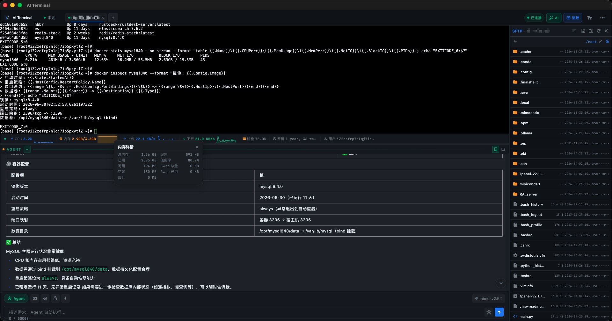
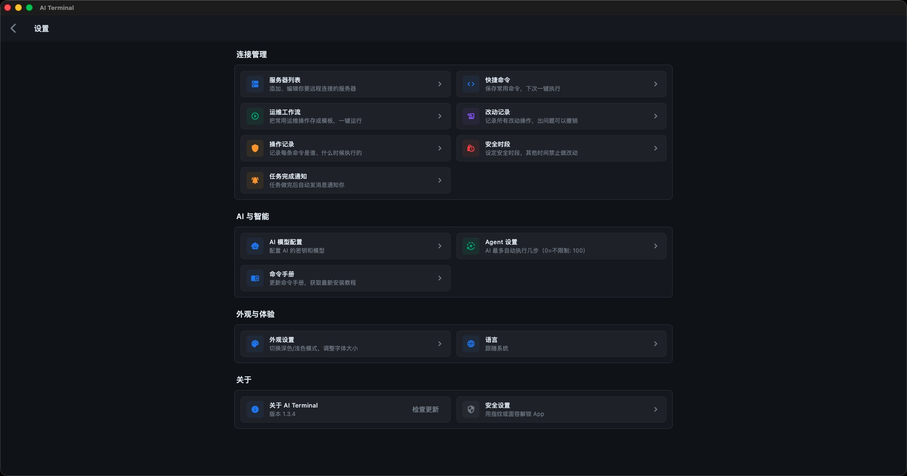
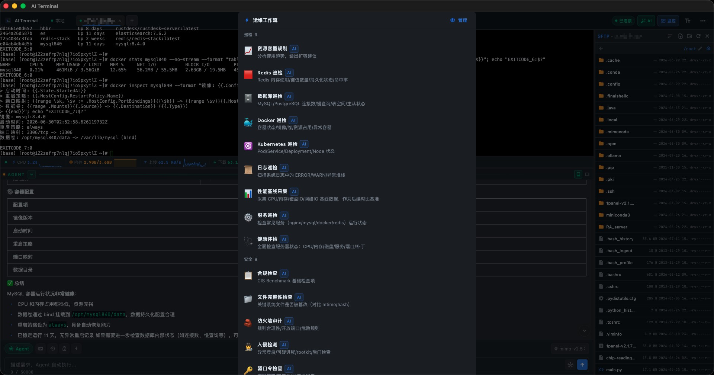
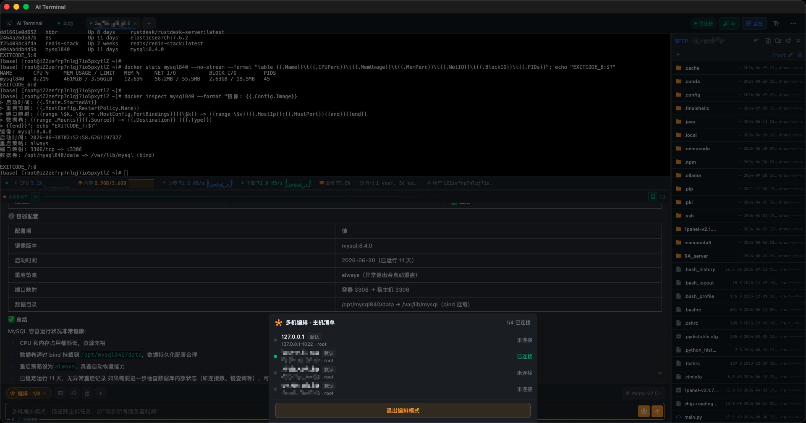
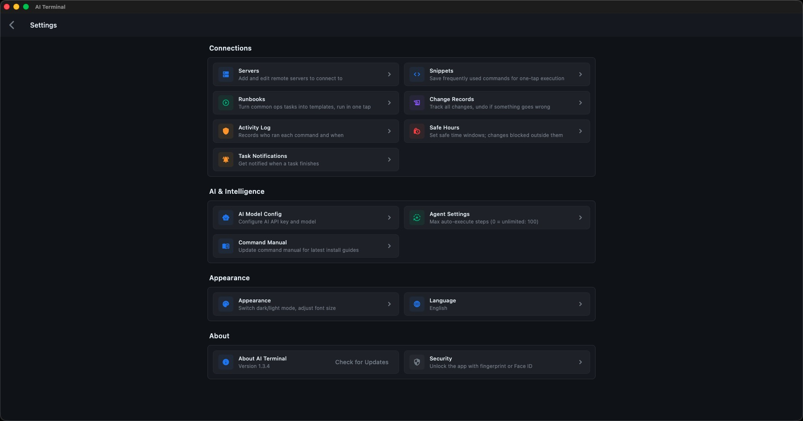
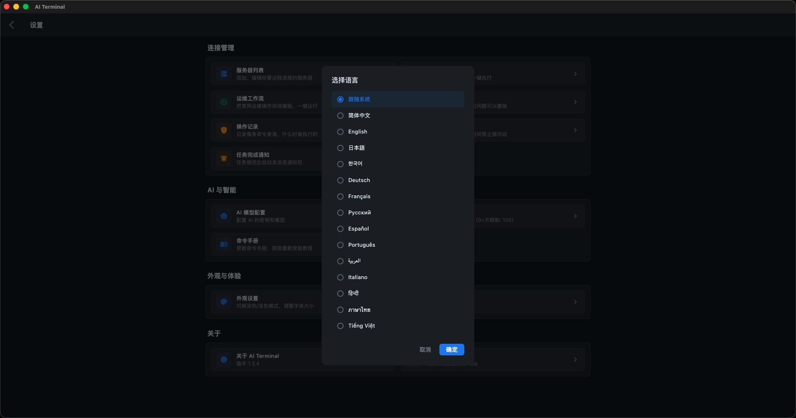

<p align="center">
  
  <h1 align="center">⚡ AI Terminal</h1>
  <p align="center">
    <strong>Controla tus servidores con lenguaje natural. La IA ejecuta los comandos por ti.</strong>
  </p>
  <p align="center">
    <a href="https://ai-terminal.keiskei.top" target="_blank">🌐 Sitio web</a> ·
    <a href="https://github.com/keiskeies/ai_terminal/releases" target="_blank">📦 Descargar</a> ·
    <a href="./QUESTION.md">❓ FAQ</a>
  </p>
  <p align="center">
    
    
    
    
  </p>
</p>

---

**🌍 Idioma:**
[中文](./README.md) | [English](./README_EN.md) | [日本語](./README_JA.md) | [Deutsch](./README_DE.md) | [Français](./README_FR.md) | **Español** | [한국어](./README_KO.md) | [Русский](./README_RU.md) | [Português](./README_PT.md) | [Italiano](./README_IT.md)

---

## Una frase para explicarlo

> **¿Nunca has usado una terminal? No hay problema.** Abre AI Terminal, dile lo que quieres en lenguaje sencillo — se conecta a tu servidor, ejecuta comandos, instala software y resuelve problemas. Todo seguro y bajo tu control.

## 🎯 ¿Te suena familiar?

### 😫 Principiantes / Usuarios no técnicos

- Alquilaste un VPS, abriste la terminal y te quedaste mirando una **pantalla negra** sin saber qué escribir
- Un amigo dijo "solo instala Nginx" — buscaste 10 tutoriales, cada uno con comandos diferentes
- Intentaste configurar Java, editaste mal `PATH` y rompiste toda tu terminal
- Alguien te advirtió sobre una vulnerabilidad del servidor — ni siquiera sabes cómo comprobarlo
- Después de 3 horas de intentar, nada funciona. Estás harto.

### 👨‍💻 Desarrolladores

- Buscas los mismos comandos `chmod` / `systemctl` cada vez
- Te conectas por SSH a un servidor y olvidas las banderas exactas de `grep` que necesitas
- ¿Quieres revisar logs? Primero, encuentra ese marcador de hace 6 meses
- 15 pestañas del navegador abiertas, cambiando entre servidores, perdiendo la pista de qué está dónde

### 🔧 DevOps / Administradores de sistemas

- ¿Mismo software en 10 servidores? Conéctate por SSH a cada uno y repite. Otra vez.
- "¿Quién cambió esa configuración?" — nadie recuerda, nada está registrado
- Un nuevo empleado pregunta "¿cómo configuro el entorno?" — lo has explicado 5 veces este mes
- ¿Quieres hacer una comprobación de estado por lotes? Escribir el script toma más tiempo que hacerlo manualmente

### 🧑‍💼 Gerentes de producto / Fundadores en solitario

- Tu único desarrollador se fue. El servidor ahora es una caja negra.
- Necesitas revisar algunos datos pero no sabes escribir SQL. Tienes que preguntarle a alguien.
- Implementar un cambio de configuración requiere un sprint de desarrollo. Es literalmente una línea.
- Tienes 5 roles. No tienes tiempo para aprender `vi`.

**¿Todos los escenarios anteriores? Una frase a AI Terminal lo resuelve.**

## 🆕 Novedades en v1.3.5

v1.3.5 es una actualización importante con **5 nuevas capacidades principales**: Monitoreo del servidor, Registro de cambios, Runbooks Ops, Centro de notificaciones y UI de glassmorfismo — una actualización completa para la eficiencia de DevOps.

### 📊 Panel de monitoreo del servidor en tiempo real

> No más escribir manualmente `top`, `df`, `free` — todas las métricas de un vistazo

| Vista general de monitoreo en tiempo real | Interruptor por host |
|:---:|:---:|
|  |  |

- **CPU / Memoria / Disco / Red** — cuatro métricas principales actualizadas en tiempo real
- **Monitoreo paralelo de múltiples hosts** — visualiza todos tus servidores desde un solo panel
- **Interruptor independiente por host** — desactiva el monitoreo de cualquier máquina en cualquier momento
- Resaltado automático de métricas anormales — detecta problemas al instante

### 📝 Registros de cambios y registros de auditoría

> ¿Quién cambió qué, y cuándo? Totalmente rastreable. La investigación post-incidente se hace fácil.

- **Registro automático de todas las operaciones del Agente**: ejecución de comandos, cambios de archivos, modificaciones de configuración
- **Gestión de ventanas de cambio**: cambios planificados vs de emergencia, categorizados
- **Registros de auditoría completos**: operador, marca de tiempo, comando, resultado, código de salida — todo consultable
- **Sugerencias de reversión**: la IA analiza el impacto del cambio y recomienda planes de reversión

### 📋 Runbooks Ops

| Lista de Runbooks | En ejecución |
|:---:|:---:|
|  |  |

- **Plantillas de ops comunes integradas**: inspección del sistema, endurecimiento de seguridad, limpieza de logs, implementación de servicios y más
- **Ejecución con un clic**: no más escribir comandos paso a paso — los runbooks se ejecutan automáticamente
- **Orquestación de múltiples hosts**: ejecuta el mismo flujo de trabajo en varios servidores en paralelo o secuencialmente
- **Runbooks personalizados**: crea tus propios playbooks de ops y codifica el conocimiento del equipo

### 🔔 Centro de notificaciones

- **Alertas de finalización de tareas** — recibe notificaciones en el momento en que terminan las tareas de larga duración
- **Alertas de anomalías** — violaciones de umbrales de monitoreo, fallos de comandos, enviados al instante
- **Recordatorios de seguridad** — operaciones de alto riesgo, comportamiento sospechoso, advertencias tempranas
- **Políticas de notificación configurables** — tú decides qué eventos activan notificaciones

### 🎨 Rediseño de UI de glassmorfismo

| Configuración (Chino) | Configuración (Inglés) |
|:---:|:---:|
|  |  |

- Nuevo **diseño de tarjeta de glassmorfismo GlassCard** con una jerarquía visual más clara
- **Refactorización del sistema de temas** — colores de tema personalizados, radio de esquina, intensidad de desenfoque
- Transiciones animadas más suaves, retroalimentación de interacción más refinada
- **Más de 15 idiomas** con cambio con un clic

| Configuración de múltiples idiomas |
|:---:|
|  |

## 💡 ¿Qué puede hacer por ti?

### ¿Instalar software? Solo di lo que quieres.

> 💬 "Instala Docker en este servidor"

La IA detecta tu versión de sistema operativo, coincide con la documentación oficial, ejecuta los comandos de instalación y verifica que funcionó. Cero comandos para memorizar.

### ¿Configurar entornos? No más dolores de cabeza con PATH.

> 💬 "Configura Python 3.12 con las variables de entorno adecuadas"

La IA sabe que Debian usa `apt`, CentOS usa `yum`, macOS usa `brew`. No adivina — sigue estrictamente la documentación oficial.

### ¿Comprobar vulnerabilidades? Es más paranoica que tú.

> 💬 "Escanea mi servidor en busca de problemas de seguridad"

La IA ejecuta comprobaciones de actualización del sistema, escaneos de puertos y auditorías de procesos automáticamente. Obtienes un informe completo de qué corregir.

### ¿Leer logs? No más buscar entre marcadores.

> 💬 "Muéstrame los errores recientes de Nginx"

La IA sabe dónde viven los logs, cómo filtrarlos y qué importa. Información clave, sin gimnasia de `tail -f`.

### ¿Gestionar servidores? Múltiples máquinas, una interfaz.

Conexiones remotas SSH con agrupación de conexiones. Cambia entre servidores con cero demora. Múltiples pestañas, una conexión compartida.

## 🛡️ Seguridad: El elefante en la habitación

Entregar tu servidor a una IA suena aterrador. Tres preocupaciones válidas:

### 🔐 "¿A dónde van mis contraseñas?"

```
Tu contraseña → Almacenamiento seguro a nivel de sistema (macOS Keychain / Android Keystore)
                       ↓
              La base de datos local solo almacena "qué clave se usó", nunca la contraseña en sí
                       ↓
              Las contraseñas nunca aparecen en texto plano en logs, archivos de configuración o en el disco
```

Incluso si alguien roba tu dispositivo, sin tu biometría/código de acceso, todo lo que obtiene es un galimatías cifrado.

### 🤖 "¿Puede la IA volverse loca?"

**No.** Tres capas de defensa:

```
┌─────────────────────────────────────────────────────┐
│ Capa 1: Prompts de límite de comportamiento          │
│ Las instrucciones del sistema de IA prohíben explícitamente: │
│   ✗ Instalar/desinstalar software sin preguntar      │
│   ✗ Modificar variables de entorno o configuraciones del sistema │
│   ✗ Ejecutar operaciones destructivas                │
│   ✓ Solicitudes de "comprobación/inspección" → comandos de solo lectura │
│   ✓ Problemas encontrados → informar primero, nunca corregir por sí sola │
└─────────────────────────────────────────────────────┘
                         ↓
┌─────────────────────────────────────────────────────┐
│ Capa 2: Clasificación de comandos SafetyGuard        │
│ Cada comando se revisa antes de la ejecución:        │
│   🔴 bloqueado → Bloqueado inmediatamente, nunca se ejecuta │
│      (rm -rf /, chmod 777, formateo de disco, etc.)  │
│   🟡 advertencia → Ventana emergente de advertencia, requiere entrada CONFIRMAR │
│      (apt install, systemctl stop, cambios de cortafuegos) │
│   🔵 info → Aviso de bajo riesgo, se ejecuta normalmente │
│      (curl, wget, ls, cat, etc.)                     │
└─────────────────────────────────────────────────────┘
                         ↓
┌─────────────────────────────────────────────────────┐
│ Capa 3: Tú eres la puerta final                      │
│ Siempre eres la última línea de defensa.             │
│ Los comandos de nivel advertencia no se ejecutan sin CONFIRMAR. │
│ Puedes interrumpir, cancelar o revisar en cualquier momento. │
└─────────────────────────────────────────────────────┘
```

### 📋 Carta de comportamiento del Agente

| Lo que puedes pedir | Lo que la IA hará | Lo que la IA no hará |
|:---|:---|:---|
| Instalar software | Generar comandos de instalación oficiales y ejecutarlos | Decidir qué versión instalar por su cuenta |
| Comprobar seguridad | Ejecutar comandos de auditoría e informar hallazgos | Corregir problemas sin tu permiso |
| Configurar entorno | Seguir exactamente la documentación oficial | Cambiar parámetros del sistema que no solicitaste |
| Leer logs | Filtrar y mostrar información clave | Eliminar o modificar archivos de log |
| Gestionar servicios | Iniciar/detener los servicios que especificaste | Iniciar otros servicios que no mencionaste |
| Ejecutar flujos de trabajo | Ejecutar pasos predefinidos automáticamente | Saltarse pasos críticos o modificar el proceso |

**En resumen: La IA es tu asistente, no tu jefe. Hace lo que le pides. Nada más.**

## ✨ Características principales

| Característica | Descripción |
|:---|:---|
| 🤖 **Ejecución automática del Agente** | La IA genera comandos y los ejecuta en bucle hasta completar la tarea |
| 📊 **Monitoreo del servidor** | Panel de CPU/memoria/disco/red en tiempo real, paralelo de múltiples hosts |
| 📝 **Registros de cambios** | Registros de auditoría completos, operaciones rastreables, listos para reversión |
| 📋 **Runbooks Ops** | Plantillas de Runbook integradas, tareas de ops comunes con un clic |
| 🔔 **Centro de notificaciones** | Finalización de tareas, alertas de anomalías, recordatorios de seguridad — enviados al instante |
| 🛡️ **Triple seguridad** | Prompts de límite de comportamiento → Clasificación de comandos SafetyGuard → Operaciones peligrosas requieren CONFIRMAR |
| 🔐 **Cero credenciales en texto plano** | Contraseñas/claves privadas en Keychain / Keystore del sistema, nunca en el disco en texto plano |
| 🖥️ **5 plataformas nativas** | macOS / Linux / Windows / Android / iOS — soporte nativo completo |
| 📡 **Local + Remoto** | Conexiones remotas SSH + terminal PTY local; el Agente funciona en ambos modos |
| 🔄 **Grupo de conexiones** | Agrupación de conexiones SSH — múltiples pestañas comparten una conexión, cambio con cero demora |
| 🌊 **Salida en streaming** | Las respuestas de la IA se renderizan en tiempo real; la salida de la terminal se transmite en vivo |
| 🧠 **Basado en conocimiento** | Más de 150 guías de instalación/configuración de software integradas — sigue la documentación oficial, sin alucinaciones de IA |
| 🌐 **Más de 20 proveedores** | DeepSeek / Qwen / Claude / Gemini / Ollama y más, con actualizaciones de configuración remota |
| 🌍 **Más de 15 idiomas** | Chino / Inglés / Japonés / Coreano / Francés / Alemán / Español / Ruso / Portugués y más |

## 🏗️ Pila tecnológica

```
Flutter 3.16+ (Dart 3.2+)
├── Gestión de estado: Riverpod
├── Enrutamiento: GoRouter
├── Almacenamiento local: Hive + flutter_secure_storage
├── SSH: dartssh2
├── Terminal local: flutter_pty
├── UI de terminal: xterm.dart
├── Interfaz de IA: Compatible con OpenAI (más de 20 proveedores)
├── Monitoreo: Panel de servidor (CPU/memoria/disco/red)
├── Ops: Registros de cambios + Registros de auditoría + Flujos de trabajo Runbook
└── UI: Glassmorfismo GlassCard + Multi-tema + Más de 15 idiomas
```

## 🚀 Comenzando

### Requisitos previos

- Flutter 3.16.0+
- Dart 3.2.0+
- Herramientas de desarrollo específicas de la plataforma (Xcode / Android Studio / VS Code, etc.)

### Instalar y ejecutar

```bash
# Clona el repositorio
git clone https://github.com/keiskeies/ai_terminal.git
cd ai_terminal/ai_terminal

# Instala las dependencias
flutter pub get

# Genera adaptadores Hive (solo la primera vez)
dart run build_runner build --delete-conflicting-outputs

# Ejecuta
flutter run
```

### Compilar para lanzamiento

```bash
# macOS
flutter build macos --release

# Windows
flutter build windows --release

# Linux
flutter build linux --release

# Android APK
flutter build apk --release

# iOS (requiere macOS + certificado de desarrollador)
flutter build ios --release
```

> 📥 O descarga binarios precompilados desde [Releases](https://github.com/keiskeies/ai_terminal/releases).

## 🔧 Configuración de modelos de IA

La aplicación viene con **más de 20 preajustes de proveedores de IA** y admite cualquier **API compatible con OpenAI**:

| Categoría | Proveedores |
|:---|:---|
| 🏠 Local | Ollama (completamente gratis, no necesita clave API) |
| 🇨🇳 Nube de China | DeepSeek / Qwen / GLM / Kimi / Doubao / MiMo / MiniMax / SiliconFlow / StepFun / Baichuan / Spark / Hunyuan |
| 🌍 Nube global | OpenAI / Claude / Gemini / xAI Grok / Mistral / OpenRouter / Groq |
| 🔧 Personalizado | Cualquier endpoint de API compatible con OpenAI |

Pasos de configuración:

1. Abre la aplicación → Configuración → Configuración del modelo de IA
2. Haz clic en `+` para añadir un modelo
3. Selecciona un proveedor (la URL base y los modelos recomendados se rellenan automáticamente)
4. Introduce tu clave API y selecciona un modelo
5. Establece como modelo predeterminado

> 💡 La lista de proveedores admite actualizaciones remotas: haz clic en el botón 🔄 junto al menú desplegable de proveedores para obtener los últimos proveedores y modelos del servidor — no se requiere actualización de la aplicación

## 📱 Capturas de pantalla

| UI principal (Monitor + Terminal) | Orquestación de múltiples hosts |
|:---:|:---:|
|  |  |

| Runbooks Ops | Página de configuración |
|:---:|:---:|
|  |  |

| Configuración de múltiples idiomas |
|:---:|
|  |

> 🤖 Características de IA impulsadas por <b>Xiaomi MiMo</b> LLM

## 📖 Demo: Instalación automática basada en conocimiento

v1.3.0 introdujo una **Base de conocimiento de manual de comandos** — más de 150 guías oficiales de instalación/desinstalación/actualización. El Agente coincide automáticamente con la base de conocimiento y sigue estrictamente los métodos oficiales, **eliminando las alucinaciones de la IA**.

A continuación: escribir "instalar openclaw" después de conectarse por SSH a un servidor Ubuntu:

| ① Introducir comando | ② Coincidencia de base de conocimiento, generar comandos |
|:---:|:---:|
|  |  |

| ③ Ejecutar instalación automáticamente | ④ Verificar instalación |
|:---:|:---:|
|  |  |

**Desglose del flujo:**

1. El usuario escribe "instalar openclaw" → El Agente extrae la operación (instalar) y la plataforma (linux)
2. La base de conocimiento coincide con `openclaw` para `linux-debian` (modo estricto), inyectando comandos de instalación oficiales
3. El Agente sigue exactamente la base de conocimiento: instala Node.js 22, luego `npm install -g openclaw`
4. Verificación post-instalación: ejecuta `openclaw --version` para confirmar el éxito

> 💡 La base de conocimiento admite coincidencia específica de plataforma (`linux-debian` vs `linux-rhel` producen diferentes comandos de gestor de paquetes), con actualizaciones remotas con un clic

## 🗺️ Hoja de ruta

- [x] v1.0.0 — Lanzamiento de características principales
  - [x] Terminal remota SSH + terminal PTY local
  - [x] Chat de IA + generación de comandos + ejecución automática
  - [x] Comprobación de seguridad de comandos SafetyGuard
  - [x] Almacenamiento cifrado de credenciales
  - [x] Configuración de múltiples modelos
- [x] v1.1.0 — Mejora de UI
  - [x] Rediseño del diseño del panel de IA
  - [x] Orientación automática en móvil
  - [x] Tema verde del modo Agente
- [x] v1.2.0 — Impulso de inteligencia del Agente
  - [x] Historial de conversación persistente entre tareas
  - [x] La salida del comando de consulta ya no está truncada
  - [x] Pasos de ejecución ilimitados por defecto
  - [x] Gestión de archivos SFTP + edición remota
- [x] v1.3.0 — Basado en conocimiento
  - [x] 🧠 Base de conocimiento de búsqueda de texto completo SQLite FTS5 (más de 150 guías de software)
  - [x] 🔄 Sincronización automática de base de conocimiento remota (actualizaciones desde GitHub al iniciar)
  - [x] 🎯 Coincidencia específica de plataforma (linux-debian / linux-rhel / macos)
  - [x] 🛡️ Reglas de seguridad LLM (aplicación estricta + prohibición de comandos de búsqueda)
  - [x] 🔧 Herramienta de construcción de base de conocimiento (CSV → SQLite)
  - [x] 💬 Mensajes de error de API amigables (401/429/tiempo de espera)
- [x] v1.3.1 — Ecosistema de proveedores
  - [x] 🌐 Más de 20 preajustes de proveedores de IA (12 de China + 8 globales + Ollama + Personalizado)
  - [x] 🔄 Actualizaciones remotas de configuración de proveedores (no se necesita actualización de la aplicación)
  - [x] 🏷️ Descripciones de proveedores e información de precios
  - [x] 🤖 Selección rápida de modelos preestablecidos (un clic)
  - [x] 🦙 Implementación local de Ollama (sin clave API, completamente gratis)
  - [x] 📐 Optimización del diálogo de añadir modelo (diseño de dos columnas en pantalla ancha)
- [x] v1.3.5 — Mega actualización de capacidades de Ops
  - [x] 📊 Monitoreo del servidor en tiempo real (CPU/memoria/disco/red, paralelo de múltiples hosts)
  - [x] 📝 Registros de cambios y registros de auditoría (historial completo de operaciones, rastreable y listo para reversión)
  - [x] 📋 Runbooks Ops (plantillas integradas + personalizadas, ejecución con un clic)
  - [x] 🔔 Centro de notificaciones (finalización de tareas, alertas de anomalías, recordatorios de seguridad)
  - [x] 🎨 Rediseño de UI de glassmorfismo (diseño GlassCard, actualización del sistema de temas)
  - [x] 🌍 Localización de más de 15 idiomas
  - [x] 📺 Orquestación de múltiples hosts (ejecutar flujos de trabajo en servidores en paralelo/serie)

## 🤝 Contribuir

¡Las contribuciones son bienvenidas! Informes de errores, sugerencias de características o código.

1. Haz un fork de este repositorio
2. Crea una rama de características (`git checkout -b feature/caracteristica-increible`)
3. Haz commit de tus cambios (`git commit -m 'Añadir característica increíble'`)
4. Haz push a la rama (`git push origin feature/caracteristica-increible`)
5. Abre una Pull Request

## 📄 Licencia

[Licencia MIT](./LICENSE)

---

## ⭐ Historial de estrellas

[](https://star-history.com/#keiskeies/ai_terminal&Date)

---

<p align="center">
  Si este proyecto te ayuda, ¡por favor dale una ⭐ Estrella!
</p>
